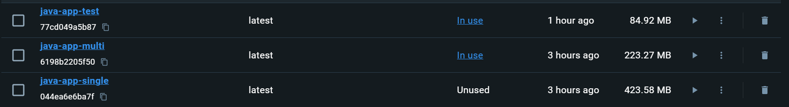

# Ex1: Deploy 1 hoặc nhiều docker container có thể phục vụ chạy airflow, ETL (sử dụng python, pandas...), có khả năng kết nối với datasource, cloud. 
Guideline:
- Install Dockers
- Install python, airflow (prefect, or dagster), selenium, requests, beautifulsoup, AWS or Azure CLI (if it is too easy for you, install pyspark) on a single container, or on different containers (it depends on how you orchestrate and use these services).
 
## Project Overview

This project sets up a scalable and efficient data pipeline for crawling, extracting, transforming, and loading data from a specific website (`https://nhacnheo.com/`). It uses Docker containers for deployment, Apache Airflow for orchestrating the ETL processes, and Firebase for data storage.

## Technologies Used

- **Docker**: Containerization to ensure consistency across various environments.
    - Docker Compose Configuration:
        - `PostgreSQL`: Acts as the backend database for Airflow.
        - Airflow `Webserver`: Provides the user interface for monitoring and managing workflows.
        - Airflow `Scheduler`: Schedules and monitors the DAGs.
- **Apache Airflow**: Workflow management platform to define, schedule, and monitor ETL tasks.
- **Python Libraries**:
  - `pandas`: For data manipulation and storage.
  - `requests`: To handle HTTP requests.
  - `BeautifulSoup`: To parse HTML and extract data.
  - `firebase_admin`: To interact with Firebase services.
- **Firebase**: Used for storing and managing song data.
- **PostgreSQL**: Database for Airflow metadata.
## ETL Process:
1. Data is crawled from the target website using the requests library for making HTTP requests and BeautifulSoup for parsing the HTML content. The extracted data includes song titles, authors, lyrics, and associated metadata.
2. The transformation step further processes the extracted data to include additional details such as PDF links associated with each song.
3. The final step involves loading the transformed data into Firebase. The data is checked for duplicates before being uploaded.

**A DAG (Directed Acyclic Graph) is defined in Airflow to schedule and manage the ETL tasks.**

# Ex2: Why docker-compose?
- Easier management and control: we can define and manage multi-container apps in a single YAML file -> simplified orchestration task and combining various services -> easier to manage and replicate app environment
- Rapid app development: Compose chaches the config used to create a container so when you restart a service that has not changed, it reuses existing containers, so we can make changes to our environment very quickly
- Portability across environments: we can set variables in Compose file to customzie composition for different environments or different users to config services
- Efficient collab: docker-compose file easy to share and allow collaboration between dev and other stakeholders

Use cases: Development environments, Automated testing environment
<!-- 
Tạo ra nhiều môi trường độc lập (isolated environments) trong một host: Compose cô lập môi trường của các project để đảm bảo chúng không bị xung đột lẫn nhau, cũng như dễ dàng tạo những bản sao của một môi trường nào đó.

Chỉ tạo lại các container đã thay đổi: Compose sẽ nhận biết được các service chưa thay đổi và sử dụng lại các container tương ứng với service đó.

Điều chỉnh các biến sử dụng cho các môi trường: Compose sử dụng các biến trong Compose file cho các môi trường. Vì vậy với môi trường hay người dùng khác nhau, có thể điều chỉnh các biến khi sử dụng Compose để thiết lập các service. -->
# Ex3: How to reduce the size of Docker images, containers?
- Utilize Multi-Stage Builds
  - Idea: **`eliminate unwanted layers in the image`**
  - We use intermediate images (build stages) to compile code, install dependencies, and package files in this approach.
  - Then only necessary app files required run the app are copied over to another image with only the required libraries, i.e., lighter to run the application.
- Use small base image (`alpine`, `busybox`,...)
- Minimize number of layers (each `RUN`, `COPY`, `FROM` Dockerfile instructions add a new layer & each layer adds to the build execution time & increases the storage requirements of the image)
- Understanding Caching
  -  add lines used for installing dependencies & packages earlier inside the `Dockerfile` – **before the COPY** commands
  - add instructions that are **less likely to change** earlier in the Dockerfile.
- `.dockerignore`:  improves caching by ignoring unnecessary files and prevents unnecessary cache invalidation.

## Practice of Multistage build and using minimal base image for a simple Java app

**Single stage build** -> 14 layers, 423.58MB

    FROM openjdk:11-jdk-slim
    WORKDIR /app

    COPY . .

    RUN javac Main.java

    CMD ["java", "Main"]

**Multi-stage build** -> 12 layers, 223.27MB

    # Build Stage
    FROM openjdk:11-jdk AS build

    WORKDIR /app

    COPY . .

    RUN javac Main.java

    # Runtime Stage
    FROM openjdk:11-jre-slim

    WORKDIR /app

    COPY --from=build /app .

    CMD ["java", "Main"]

**Multi-stage + Minimal base image** -> 12 layers, 84.92MB

    # Stage 1: Build
    FROM openjdk:8-jdk-alpine AS build

    WORKDIR /app

    COPY Main.java .

    RUN javac Main.java

    # Stage 2: Runtime
    FROM openjdk:8-jre-alpine

    WORKDIR /app

    COPY --from=build /app .

    CMD ["java", "Main"]
